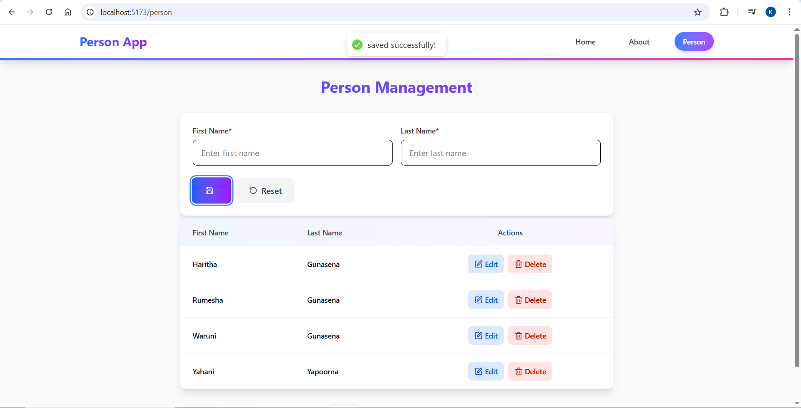
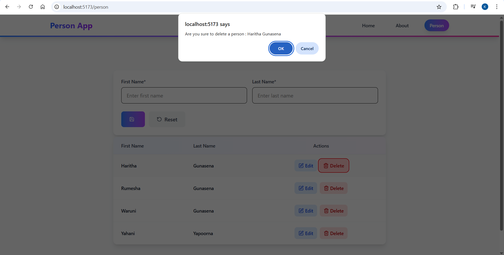

# DotnetReactJS Full Stack Person App

A full-stack web application built with **ASP.NET Core** (backend) and **React.js** (frontend). The project demonstrates connecting a React client to a .NET Web API backend (CRUD operations and API integration).

## Key Features

- ASP.NET Core Web API backend (C#)  
- React.js frontend client  
- RESTful API endpoints for CRUD operations  
- Clean project structure separating backend and client
---

## Tech Stack

- **Frontend:** React.js, npm, Axios  
- **Backend:** ASP.NET Core Web API, C# (.NET SDK)  
- **Database:** SQLite 
- **Tools:** Visual Studio / VS Code, Postman (for API testing), Git
---

## Repository structure

```

DotnetReactJS-Full-Stack-App/
│
├── Backend/                            # .NET 8 Web API
│   ├── Backend.csproj
│   ├── Program.cs                      # Entry point for the backend API
│   ├── appsettings.json                # App configuration (DB connection etc.)
│   ├── person.http                     # Used for testing API endpoints
│   │
│   ├── Controllers/                    # Contains API controllers
│   │   └── PersonController.cs
│   │
│   ├── Models/                         # Contains entity and data models
│   │   └── Person.cs
│   │
│   ├── Migrations/                     # Entity Framework Core migrations
│   │   └── [timestamp]_InitialCreate.cs
│   │
│   ├── Properties/                     # Project metadata
│   └── Person.db                       # SQLite database file
│
│
├── Client/                             # React Frontend (Vite)
│   ├── package.json                    # Frontend dependencies
│   ├── vite.config.js                  # Vite configuration
│   ├── index.html                      # Root HTML file
│   │
│   ├── src/
│   │   ├── assets/                     # Static assets (images, icons)
│   │   ├── components/                 # Reusable UI components
│   │   ├── pages/                      # Application pages
│   │   ├── App.jsx                     # Main App component
│   │   ├── main.jsx                    # Entry point for React app
│   │   └── index.css                   # Global styles
│   │
│   ├── .env                            # Environment variables
│   ├── eslint.config.js                # Linting configuration
│   ├── package-lock.json
│   └── node_modules/
│
│
└── README.md                           # Project documentation


````
## Application Preview




---

## Prerequisites

Before running the project locally, make sure you have installed:

- [Node.js & npm](https://nodejs.org/)  
- [.NET SDK (6/7)](https://dotnet.microsoft.com/download) — match the .NET version used in `Backend` project (check `TargetFramework` in `.csproj`)  
- (If using a DB) MySQL / SQL Server / SQLite — whichever your backend expects

---

## Local setup — Backend

1. Open a terminal and go to the `Backend` folder:
   ```bash
   cd Backend
   ````
2. Restore and build the project:
   ```bash
   dotnet restore
   dotnet build
   ```
3. Configure database settings:
   * Open `appsettings.json` in the `Backend` project and update the connection string and other settings (if any).
   * If the project uses EF Core migrations, run:
     ```bash
     dotnet ef database update
     ```
   > If you don’t use EF Core migrations, start the database manually and ensure the connection string is correct.

4. Run the backend API:
   ```bash
   dotnet run
   ```
   The API typically runs on `https://localhost:5001` or `http://localhost:5000` (check the console to confirm the actual URL).
---

## Local setup — Frontend (React)

1. Open a terminal and go to the `Client` folder:
   ```bash
   cd Client
   ```
2. Install dependencies:
   ```bash
   npm install
   ```
3. Start the development server:
   ```bash
   npm start
   ```
   The app will usually open at `http://localhost:3000`. Ensure the frontend API base URL points to your backend URL (check `.env` or API config in `src`).
---

## Configure Frontend ↔ Backend Communication

* Find where the frontend calls the backend (often an `api.js`, `services/`, or in component `axios` calls).
* Update the base URL to match the running backend (e.g., `https://localhost:5001/api`).

Example (Axios):

```js
// src/services/api.js
import axios from "axios";
export default axios.create({
  baseURL: "https://localhost:5001/api" // update if needed
});
```
---

## Testing the API

Use Postman or curl to test endpoints directly:

```bash
GET  https://localhost:5001/api/yourcontroller
POST https://localhost:5001/api/yourcontroller
PUT  https://localhost:5001/api/yourcontroller/{id}
DELETE https://localhost:5001/api/yourcontroller/{id}
```
---

## Notes & To-Do (Please verify)

* **Database type:** I couldn’t determine the exact DB from the repo browsing. If you use **MySQL**, **SQL Server**, or **SQLite**, add clear instructions (connection string example) in `Backend/README` or `appsettings.json`.
* **Environment files:** If frontend uses `.env`, include a sample `.env.example` showing `REACT_APP_API_BASE_URL=http://localhost:5000/api`.
* **Migrations:** If you use EF Core migrations, include the generated `Migrations/` folder and migration commands in this README.
---

## Author

**Waruni Gunasena**
Full Stack Developer (ASP.NET Core + React)

